# Plan: harness-runtime-enforcement

## 目标

将 Harness 门禁从“被动脚本”升级为“**主动拦截 + 计划解析 + 强制证据留档**”的完整系统架构。
彻底废弃物理 Git Hook，转而使用 Agent 专属 Hook（Cursor/Claude 拦截器）进行环境唤醒。

确立清晰的生命周期职责边界：
1. **plan (任务定义与共创留档)**：不仅是任务蓝图，更是人类开发者与 AI Agent 共同讨论、规划并制定的计划流程的正式留档位置（`harness/plans/`）。
2. **session (运行态凭证)**：机器读的本轮执行状态，免受多人协同的运行态合并冲突（位于 `harness/sessions/`，且**完全被 git 忽略**）。
3. **evidence / report (交付证明)**：自动化校验生成的成果发票。
4. **work-record (可提交历史)**：真正可随代码提交并永远追踪的归档。

## Agent 入场与工作全生命周期流转

```mermaid
sequenceDiagram
    actor User as 人类开发者
    participant Agent as AI Agent
    participant Harness as Harness门禁 (guard.ps1)
    participant Plan as harness/plans (计划库)
    participant Session as harness/sessions (运行态凭证)

    %% 阶段1：入场与初始化
    rect rgb(30, 41, 59)
    note right of User: Phase 1: 入场检查与认领
    Agent->>Harness: 触发拦截器或主动运行 `.\h` 
    alt 0 个 Session / 多个 Session 冲突
        Harness-->>Agent: Fail-Hard: 阻断并要求传参
        Agent->>User: 请分配我的身份 (e.g. .\h developer)
        User-->>Agent: 确认身份
        Agent->>Harness: 执行 `.\h developer` 认领身份
    else 1 个匹配 Session
        Harness-->>Agent: OK: 自动恢复上下文
    end
    end

    %% 阶段2：共创计划与发布
    rect rgb(15, 23, 42)
    note right of User: Phase 2: 共同制作 Plan
    User->>Agent: 提出新需求
    Agent-->>User: 与人类探讨整体架构和实施步骤
    User->>Agent: 批准最终实施方案
    Agent->>Plan: 在 harness/plans/<task-id>.md 写入定稿计划
    Agent->>Harness: 更新 current-task.json 绑定 task-id
    end

    %% 阶段3：开工执行与免 Token 同步
    rect rgb(30, 41, 59)
    note right of User: Phase 3: 开工执行与状态同步
    loop 开发迭代
        Agent->>Agent: 修改代码并在 plans/<task-id>.md 更新 `[x]`
        Agent->>Harness: 执行阶段性命令 (如 pre-commit / inspect)
        Harness->>Plan: (只读) 提取 Markdown 中的计划进度
        Harness->>Session: 同步最新状态至本机的 .session-*.json (不上 Git)
        Harness->>Harness: 严格执行 allowed_files/forbidden_files 门禁审计
    end
    end

    %% 阶段4：交付与核账
    rect rgb(15, 23, 42)
    note right of User: Phase 4: 交付留档
    Agent->>Harness: 完成开发，运行 `.\h flow`
    Harness-->>Agent: 输出全绿码及 evidence 发票
    Agent->>Harness: 撰写 harness/work-records/<task-id>.md
    Agent-->>User: 提交工作总结与交接，任务完成
    end
```



## 范围

会修改：
- `harness/policy/guard.ps1`
- `harness/agent-entry.md` / `AGENTS.md` / `harness/workflow.md`
- `harness/.gitignore`（忽略小票）
- `harness/current-task.json`
- `harness/templates/task-harness-runtime-enforcement.example.json`
- `harness/plans/harness-runtime-enforcement.md`
- `harness/work-records/harness-runtime-enforcement.md`
- `harness/handoff.md`

不会修改：
- `src/**` / `scripts/**` / `docs/**` / `脚本/**` / `public/**`
- 任何生成物（`src/data/plot-data.json` 等）

## 步骤

1. [x] 将全生命周期流转与新方案蓝图更新留档至 `harness/plans/harness-runtime-enforcement.md` (本文)。
2. [x] 删除死代码：彻底从 `guard.ps1` 中移除 `Ensure-GitHook` 及其调用。
3. [x] 设置 Session 隔离：
   - 创建 `harness/sessions/` 并写入 `.gitkeep`。
   - 修改 `harness/.gitignore` 彻底忽略 `.session-*.json`，防止运行态污染项目事实。
4. [x] 改造状态路径及 Role 隔离：
   - 将 `guard.ps1` 中的 `$SessionStatePath` 重构为基于 `task.id + HARNESS_AGENT_LABEL + Role` 的独立多态路径。
   - 修复 role 冲突逻辑：校验传入的 Role 与已有 session 状态的角色是否一致，不一致时抛错（Fail-Hard）。
   - 完善无参 `.\h` 推断：0 个 session 报错阻断；1 个匹配当前 task 时自动恢复；多个匹配时 Fail-Hard 要求明确传参。
5. [x] 解析步骤进度（只读）：在 `guard.ps1` 增加 `Sync-PlanSteps`，只读提取 `## 步骤` 区块的状态并写入当前机器独有的 session json 中。
6. [x] 精准控制边界（最高优核心任务）：
   - 增强 `Assert-FileBoundaries`，彻底替换原来的角色目录判断。
   - 读取并严格比对 `current-task.json` 的 `allowed_files` / `forbidden_files` 以精准管控。
7. [x] 同步规范更新：修改 `AGENTS.md`、`agent-entry.md`、`workflow.md`，明确说明 Plan 的人工共创定位和免 Token 解析逻辑。
8. [x] 验证所有阻断（Fail-Hard）边界逻辑有效。
9. [x] 编写工作记录 `harness/work-records/harness-runtime-enforcement.md` 并更新 `harness/handoff.md`。

## 验证

按顺序在 `tavern-web/` 下执行：

```powershell
powershell -ExecutionPolicy Bypass -File .\harness\policy\guard.ps1 -Stage inspect
powershell -ExecutionPolicy Bypass -File .\harness\policy\guard.ps1 -Stage report
powershell -ExecutionPolicy Bypass -File .\harness\policy\guard.ps1 -Stage pre-stop
```

自检：
- 故意造越界改动（如 `tavern-web/src/test.tmp`），再跑 `inspect` 应被 `out-of-scope-file` 拦下。
- 删 `harness/sessions/` 下的专属小票后跑 `pre-stop`，应被 `missing-session-state` 拦下。
- 传入不同 role 参数，确保产生错误拦截或隔离创建新 json。
- 执行无参 `.\h` 验证 0个/1个/多个会话时的表现。